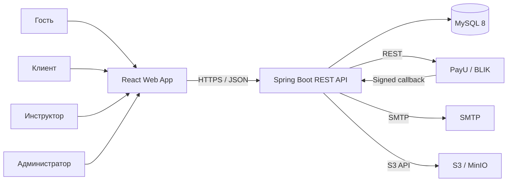
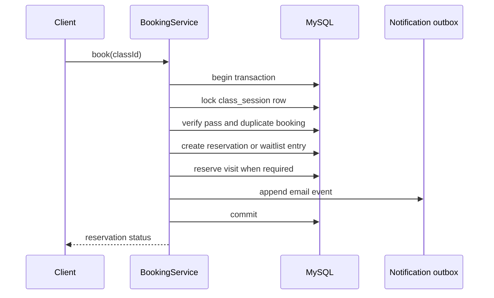
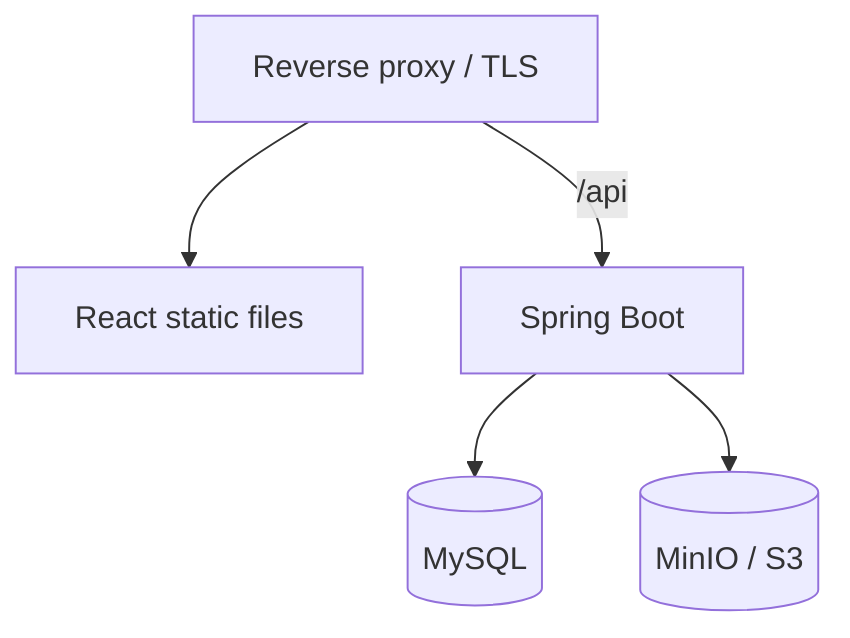

# DSMS: архитектура системы

## 1. Архитектурный стиль

Первая версия строится как модульный монолит:

- один backend на Java 21 и Spring Boot 3;
- один frontend на React 18;
- одна база данных MySQL 8;
- отдельные внешние сервисы PayU, SMTP и S3/MinIO;
- развертывание компонентов через Docker Compose.

Модульный монолит выбран потому, что он снижает сложность MVP, сохраняет
транзакционность бронирований и абонементов и не мешает позднее выделить
платежи или уведомления в отдельные сервисы.

## 2. Контекст системы



## 3. Backend-модули

| Модуль | Ответственность |
|---|---|
| `auth` | регистрация, подтверждение email, вход, JWT, refresh token, восстановление пароля |
| `user` | профили, роли, блокировки, фотографии, управление пользователями |
| `catalog` | направления, уровни и данные инструкторов |
| `schedule` | занятия, публикация, отмена и просмотр расписания |
| `booking` | бронирования, лист ожидания, продвижение очереди |
| `membership` | типы абонементов, пользовательские абонементы, журнал посещений |
| `payment` | заказы, платежи, PayU, обработка callback |
| `attendance` | отметки присутствия и отсутствия |
| `review` | оценки, отзывы и скрытие отзывов |
| `event` | разовые мероприятия и управление ими |
| `notification` | email outbox, шаблоны, плановые напоминания и повторные отправки |
| `reporting` | агрегаты, отчеты и экспорт CSV |
| `audit` | аудит административных и критичных операций |
| `shared` | ошибки, базовые типы, конфигурация и общая инфраструктура |

Модули не обращаются напрямую к внутренним классам соседнего модуля. Для
взаимодействия используются публичные application-сервисы и доменные события.

## 4. Слои backend

Внутри каждого модуля используются четыре логических слоя:

```text
api             REST-контроллеры, request/response DTO
application     сценарии использования, транзакции, права доступа
domain          сущности, бизнес-правила, доменные события
infrastructure  JPA, PayU, SMTP, S3, планировщики
```

Зависимости направлены от внешних слоев к доменному. JPA-сущности могут
совпадать с доменными сущностями в MVP, если это не нарушает границы модулей.

## 5. Frontend-архитектура

Frontend разделяется по предметным областям:

```text
src/
  app/          router, providers, theme, authorization guards
  api/          Axios instance, interceptors, generated/shared API types
  features/     auth, profile, schedule, booking, passes, payments, reviews
  pages/        public, client, instructor, admin
  components/   общие UI-компоненты
  hooks/        общие React hooks
  utils/        форматирование дат, денег и ошибок
```

Основные решения:

- React Router DOM для маршрутизации;
- Material UI для компонентов и адаптивной темы;
- Axios для HTTP-запросов;
- access token хранится в памяти приложения;
- refresh token передается в `HttpOnly`, `Secure`, `SameSite` cookie;
- сервер остается источником истины для ролей, цен и доступности мест;
- даты API передаются в ISO 8601, отображаются в часовом поясе школы.

## 6. Аутентификация и авторизация

1. После входа backend возвращает короткоживущий access token.
2. Refresh token хранится в хешированном виде в БД и передается cookie.
3. Обновление токена выполняет ротацию refresh token.
4. Выход отзывает текущую сессию.
5. Backend проверяет роль и принадлежность ресурса на каждом защищенном
   endpoint.
6. Для браузерной аутентификации refresh endpoint защищается CSRF-токеном.

Предлагаемые сроки:

- access token: 15 минут;
- refresh token: 30 дней;
- подтверждение email: 24 часа;
- восстановление пароля: 30 минут.

## 7. Критические транзакции

### Бронирование места



Строка занятия блокируется через `SELECT ... FOR UPDATE` или эквивалентный
pessimistic write lock. Это не позволяет двум параллельным запросам занять
последнее место.

### Продвижение листа ожидания

Отмена брони, возврат посещения и перевод первого участника очереди выполняются
в одной транзакции. Порядок определяется `position`, затем `created_at`.

### Обработка платежа

Callback PayU:

1. проходит проверку подписи;
2. сохраняется с уникальным идентификатором события;
3. блокирует заказ на время обработки;
4. сверяет сумму и валюту;
5. идемпотентно меняет статус платежа;
6. один раз создает пользовательский абонемент;
7. добавляет уведомление в outbox.

## 8. Асинхронные операции

В MVP используется transactional outbox в MySQL, без отдельного брокера:

- бизнес-транзакция записывает событие в `notification_outbox`;
- планировщик выбирает необработанные записи небольшими пакетами;
- после успешной отправки фиксируется время отправки;
- при ошибке увеличивается счетчик попыток и назначается повтор.

Планировщики также:

- отправляют напоминания за 24 часа;
- помечают истекшие заказы и токены;
- переводят истекшие абонементы в неактивное состояние;
- очищают отозванные и просроченные refresh token.

## 9. Работа с файлами

- Backend принимает изображение профиля через multipart endpoint.
- Допустимые форматы: JPEG, PNG и WebP.
- Максимальный размер по умолчанию: 5 МБ.
- Объект получает случайный ключ, не содержащий исходное имя файла.
- В БД хранится ключ объекта, а не бинарное содержимое.
- В локальной среде используется MinIO, в production — совместимое S3.

## 10. Наблюдаемость

- структурированные логи с correlation ID;
- Spring Boot Actuator для health и metrics;
- отдельные readiness и liveness endpoints;
- аудит входов, ролей, ручных корректировок и платежных операций;
- секреты, токены и персональные данные не записываются в логи.

## 11. Развертывание



Локальный Docker Compose будет содержать:

- `frontend`;
- `backend`;
- `mysql`;
- `minio`;
- локальный SMTP-сервис для разработки.

Production может использовать управляемые MySQL, S3 и SMTP без изменений
прикладной логики.

## 12. Архитектурные решения

| ID | Решение |
|---|---|
| ADR-01 | Модульный монолит вместо микросервисов для MVP |
| ADR-02 | REST API с префиксом `/api/v1` |
| ADR-03 | JWT access token и ротируемый refresh token |
| ADR-04 | MySQL — источник истины для бронирований и платежей |
| ADR-05 | Pessimistic lock для конкурентного бронирования |
| ADR-06 | Transactional outbox для email |
| ADR-07 | BLIK предоставляется через PayU |
| ADR-08 | Файлы хранятся в S3-совместимом хранилище |
| ADR-09 | Flyway управляет изменениями схемы БД |

