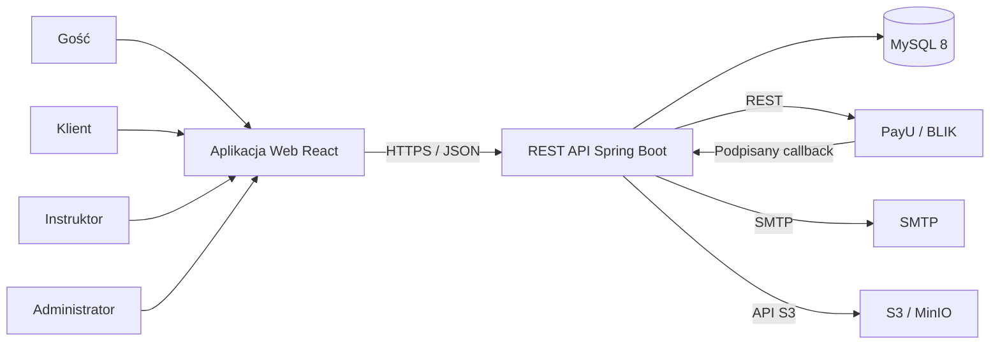
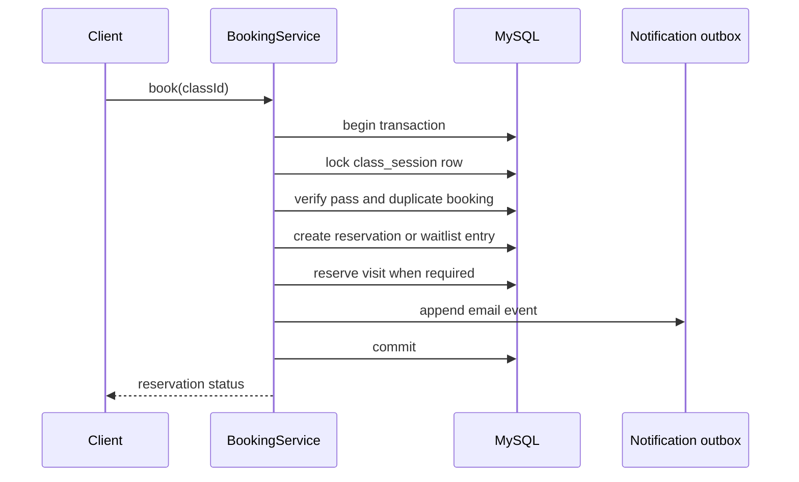
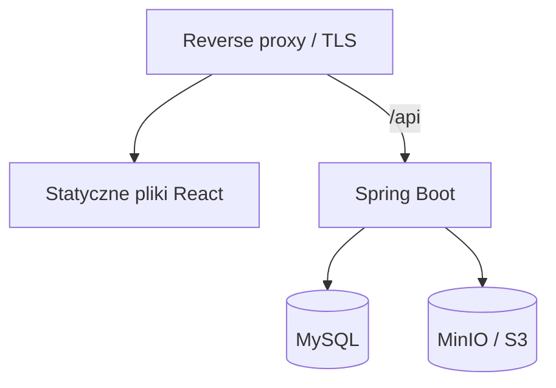

# DSMS: architektura systemu

## 1. Styl architektoniczny

Pierwsza wersja jest budowana jako modularny monolit:

- jeden backend oparty o Java 21 i Spring Boot 3;
- jeden frontend oparty o React 18;
- jedna baza danych MySQL 8;
- osobne zewnętrzne usługi PayU, SMTP i S3/MinIO;
- wdrażanie komponentów przez Docker Compose.

Modularny monolit został wybrany dlatego, że zmniejsza złożoność MVP, zachowuje
transakcyjność rezerwacji i karnetów, a jednocześnie nie blokuje późniejszego
wydzielenia płatności lub powiadomień do osobnych usług.

## 2. Kontekst systemu



## 3. Moduły backendu

| Moduł | Odpowiedzialność |
|---|---|
| `auth` | rejestracja, potwierdzenie email, logowanie, JWT, refresh token, reset hasła |
| `user` | profile, role, blokady, zdjęcia, zarządzanie użytkownikami |
| `catalog` | style, poziomy i dane instruktorów |
| `schedule` | zajęcia, publikacja, anulowanie i przegląd grafiku |
| `booking` | rezerwacje, lista oczekujących, przesuwanie kolejki |
| `membership` | typy karnetów, karnety użytkowników, rejestr wejść |
| `payment` | zamówienia, płatności, PayU, obsługa callbacków |
| `attendance` | oznaczanie obecności i nieobecności |
| `review` | oceny, opinie i ukrywanie opinii |
| `event` | jednorazowe wydarzenia i zarządzanie nimi |
| `notification` | email outbox, szablony, przypomnienia planowane i ponowne wysyłki |
| `reporting` | agregaty, raporty i eksport CSV |
| `audit` | audyt operacji administracyjnych i krytycznych |
| `shared` | błędy, typy bazowe, konfiguracja i wspólna infrastruktura |

Moduły nie odwołują się bezpośrednio do wewnętrznych klas sąsiednich modułów.
Do współpracy służą publiczne serwisy aplikacyjne i zdarzenia domenowe.

## 4. Warstwy backendu

Wewnątrz każdego modułu występują cztery logiczne warstwy:

```text
api             kontrolery REST, request/response DTO
application     scenariusze użycia, transakcje, prawa dostępu
domain          encje, zasady biznesowe, zdarzenia domenowe
infrastructure  JPA, PayU, SMTP, S3, harmonogramy
```

Zależności biegną od warstw zewnętrznych do domeny. Encje JPA mogą pokrywać się
z encjami domenowymi w MVP, o ile nie narusza to granic modułów.

## 5. Architektura frontendu

Frontend jest podzielony według obszarów domenowych:

```text
src/
  app/          router, providery, theme, guardy autoryzacji
  api/          instancja Axios, interceptory, wspólne/generowane typy API
  features/     auth, profile, schedule, booking, passes, payments, reviews
  pages/        public, client, instructor, admin
  components/   wspólne komponenty UI
  hooks/        wspólne hooki React
  utils/        formatowanie dat, pieniędzy i błędów
```

Główne decyzje:

- React Router DOM do routingu;
- Material UI do komponentów i responsywnego motywu;
- Axios do zapytań HTTP;
- access token jest przechowywany w pamięci aplikacji;
- refresh token jest przekazywany w ciasteczku `HttpOnly`, `Secure`, `SameSite`;
- serwer pozostaje źródłem prawdy dla ról, cen i dostępności miejsc;
- daty API są przekazywane w ISO 8601 i wyświetlane w strefie czasowej szkoły.

## 6. Uwierzytelnianie i autoryzacja

1. Po zalogowaniu backend zwraca krótkowieczny access token.
2. Refresh token jest przechowywany w bazie w formie hasha i przekazywany przez cookie.
3. Odświeżenie tokena wykonuje rotację refresh tokena.
4. Wylogowanie odwołuje bieżącą sesję.
5. Backend sprawdza rolę i własność zasobu na każdym chronionym endpointzie.
6. Dla uwierzytelniania przeglądarkowego endpoint refresh jest chroniony tokenem CSRF.

Proponowane czasy:

- access token: 15 minut;
- refresh token: 30 dni;
- potwierdzenie email: 24 godziny;
- reset hasła: 30 minut.

## 7. Transakcje krytyczne

### Rezerwacja miejsca



Wiersz zajęć jest blokowany przez `SELECT ... FOR UPDATE` albo równoważny
`pessimistic write lock`. Dzięki temu dwa równoległe żądania nie zajmą
ostatniego miejsca jednocześnie.

### Przesunięcie listy oczekujących

Anulowanie rezerwacji, zwrot wejścia i przeniesienie pierwszej osoby z kolejki
wykonywane są w jednej transakcji. Kolejność jest określana przez `position`,
a następnie `created_at`.

### Obsługa płatności

Callback PayU:

1. przechodzi weryfikację podpisu;
2. jest zapisywany z unikalnym identyfikatorem zdarzenia;
3. blokuje zamówienie na czas przetwarzania;
4. porównuje kwotę i walutę;
5. idempotentnie zmienia status płatności;
6. tylko raz tworzy karnet użytkownika;
7. dodaje powiadomienie do outboxa.

## 8. Operacje asynchroniczne

W MVP wykorzystywany jest transactional outbox w MySQL, bez osobnego brokera:

- transakcja biznesowa zapisuje zdarzenie do `notification_outbox`;
- harmonogram wybiera nieprzetworzone rekordy małymi paczkami;
- po udanej wysyłce zapisywany jest czas wysłania;
- przy błędzie zwiększa się licznik prób i planowana jest ponowna wysyłka.

Harmonogramy dodatkowo:

- wysyłają przypomnienia 24 godziny przed zajęciami;
- oznaczają wygasłe zamówienia i tokeny;
- przełączają wygasłe karnety do stanu nieaktywnego;
- czyszczą odwołane i przeterminowane refresh tokeny.

## 9. Obsługa plików

- Backend przyjmuje zdjęcie profilowe przez endpoint multipart.
- Dopuszczalne formaty: JPEG, PNG i WebP.
- Domyślny maksymalny rozmiar: 5 MB.
- Obiekt dostaje losowy klucz bez oryginalnej nazwy pliku.
- W bazie przechowywany jest klucz obiektu, a nie dane binarne.
- Lokalnie używane jest MinIO, a w production magazyn zgodny z S3.

## 10. Obserwowalność

- ustrukturyzowane logi z correlation ID;
- Spring Boot Actuator dla health i metrics;
- osobne endpointy readiness i liveness;
- audyt logowań, ról, ręcznych korekt i operacji płatniczych;
- sekrety, tokeny i dane osobowe nie trafiają do logów.

## 11. Wdrożenie



Lokalny Docker Compose będzie zawierał:

- `frontend`;
- `backend`;
- `mysql`;
- `minio`;
- lokalną usługę SMTP do developmentu.

Production może używać zarządzanych MySQL, S3 i SMTP bez zmian w logice
aplikacyjnej.

## 12. Decyzje architektoniczne

| ID | Decyzja |
|---|---|
| ADR-01 | Modularny monolit zamiast mikrousług dla MVP |
| ADR-02 | REST API z prefiksem `/api/v1` |
| ADR-03 | JWT access token i rotowany refresh token |
| ADR-04 | MySQL jako źródło prawdy dla rezerwacji i płatności |
| ADR-05 | Pessimistic lock dla współbieżnych rezerwacji |
| ADR-06 | Transactional outbox dla emaili |
| ADR-07 | BLIK jest dostarczany przez PayU |
| ADR-08 | Pliki są przechowywane w magazynie zgodnym z S3 |
| ADR-09 | Flyway zarządza zmianami schematu bazy danych |
