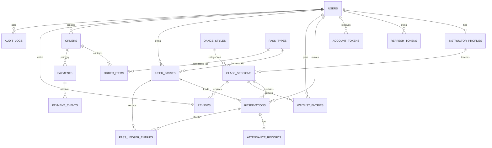

# DSMS: проектирование базы данных

## 1. Общие соглашения

- СУБД: MySQL 8, движок InnoDB, кодировка `utf8mb4`.
- Первичные ключи: `BIGINT UNSIGNED AUTO_INCREMENT`.
- Время хранится в UTC в типе `DATETIME(6)`.
- Денежные значения: `DECIMAL(12,2)`.
- Валюта: трехбуквенный код ISO 4217.
- Все изменения схемы выполняются Flyway-миграциями.
- Для изменяемых сущностей используются `created_at`, `updated_at` и
  оптимистическая версия `version`, где это необходимо.
- Удаление пользователей, абонементов и финансовых данных логическое.

## 2. ER-диаграмма

## 3. Таблицы

### `users`

| Поле | Тип | Ограничения |
|---|---|---|
| `id` | BIGINT UNSIGNED | PK |
| `first_name` | VARCHAR(100) | NOT NULL |
| `last_name` | VARCHAR(100) | NOT NULL |
| `email` | VARCHAR(254) | NOT NULL, хранится в нижнем регистре |
| `phone` | VARCHAR(32) | NULL |
| `password_hash` | VARCHAR(100) | NOT NULL |
| `role` | VARCHAR(20) | CLIENT, INSTRUCTOR, ADMIN |
| `status` | VARCHAR(20) | PENDING, ACTIVE, BLOCKED, DEACTIVATED |
| `avatar_object_key` | VARCHAR(500) | NULL |
| `email_verified_at` | DATETIME(6) | NULL |
| `failed_login_attempts` | SMALLINT UNSIGNED | NOT NULL DEFAULT 0 |
| `locked_until` | DATETIME(6) | NULL |
| `last_login_at` | DATETIME(6) | NULL |
| `created_at` | DATETIME(6) | NOT NULL |
| `updated_at` | DATETIME(6) | NOT NULL |
| `version` | BIGINT UNSIGNED | NOT NULL DEFAULT 0 |

Ограничения и индексы:

- `UNIQUE(email)`;
- `INDEX(role, status)`;
- email нормализуется приложением до вставки.

### `instructor_profiles`

| Поле | Тип | Ограничения |
|---|---|---|
| `id` | BIGINT UNSIGNED | PK |
| `user_id` | BIGINT UNSIGNED | NOT NULL, FK users, UNIQUE |
| `specialization` | VARCHAR(255) | NOT NULL |
| `description` | TEXT | NULL |
| `is_public` | BOOLEAN | NOT NULL DEFAULT TRUE |
| `created_at` | DATETIME(6) | NOT NULL |
| `updated_at` | DATETIME(6) | NOT NULL |

### `refresh_tokens`

| Поле | Тип | Ограничения |
|---|---|---|
| `id` | BIGINT UNSIGNED | PK |
| `user_id` | BIGINT UNSIGNED | NOT NULL, FK users |
| `token_hash` | CHAR(64) | NOT NULL, UNIQUE |
| `family_id` | CHAR(36) | NOT NULL |
| `expires_at` | DATETIME(6) | NOT NULL |
| `revoked_at` | DATETIME(6) | NULL |
| `replaced_by_hash` | CHAR(64) | NULL |
| `created_at` | DATETIME(6) | NOT NULL |
| `created_ip` | VARCHAR(45) | NULL |

Индексы: `(user_id, expires_at)`, `(family_id)`.

### `account_tokens`

Одноразовые токены подтверждения email и восстановления пароля.

| Поле | Тип | Ограничения |
|---|---|---|
| `id` | BIGINT UNSIGNED | PK |
| `user_id` | BIGINT UNSIGNED | NOT NULL, FK users |
| `type` | VARCHAR(30) | EMAIL_VERIFICATION, PASSWORD_RESET |
| `token_hash` | CHAR(64) | NOT NULL, UNIQUE |
| `expires_at` | DATETIME(6) | NOT NULL |
| `used_at` | DATETIME(6) | NULL |
| `created_at` | DATETIME(6) | NOT NULL |

### `dance_styles`

| Поле | Тип | Ограничения |
|---|---|---|
| `id` | BIGINT UNSIGNED | PK |
| `name` | VARCHAR(100) | NOT NULL, UNIQUE |
| `description` | TEXT | NULL |
| `active` | BOOLEAN | NOT NULL DEFAULT TRUE |
| `created_at` | DATETIME(6) | NOT NULL |
| `updated_at` | DATETIME(6) | NOT NULL |

### `class_sessions`

| Поле | Тип | Ограничения |
|---|---|---|
| `id` | BIGINT UNSIGNED | PK |
| `title` | VARCHAR(150) | NOT NULL |
| `description` | TEXT | NULL |
| `dance_style_id` | BIGINT UNSIGNED | NOT NULL, FK dance_styles |
| `level` | VARCHAR(20) | BEGINNER, INTERMEDIATE, ADVANCED, ALL |
| `instructor_id` | BIGINT UNSIGNED | NOT NULL, FK instructor_profiles |
| `capacity` | SMALLINT UNSIGNED | NOT NULL, > 0 |
| `start_at` | DATETIME(6) | NOT NULL |
| `duration_minutes` | SMALLINT UNSIGNED | NOT NULL, > 0 |
| `status` | VARCHAR(20) | DRAFT, PUBLISHED, CANCELLED, COMPLETED |
| `cancellation_reason` | VARCHAR(500) | NULL |
| `created_by` | BIGINT UNSIGNED | NOT NULL, FK users |
| `created_at` | DATETIME(6) | NOT NULL |
| `updated_at` | DATETIME(6) | NOT NULL |
| `version` | BIGINT UNSIGNED | NOT NULL DEFAULT 0 |

Индексы:

- `(status, start_at)`;
- `(instructor_id, start_at)`;
- `(dance_style_id, level, start_at)`.

### `reservations`

| Поле | Тип | Ограничения |
|---|---|---|
| `id` | BIGINT UNSIGNED | PK |
| `user_id` | BIGINT UNSIGNED | NOT NULL, FK users |
| `class_session_id` | BIGINT UNSIGNED | NOT NULL, FK class_sessions |
| `user_pass_id` | BIGINT UNSIGNED | NOT NULL, FK user_passes |
| `status` | VARCHAR(30) | CONFIRMED, CANCELLED, LATE_CANCELLED, NO_SHOW, ATTENDED |
| `source` | VARCHAR(20) | CLIENT, WAITLIST, ADMIN |
| `cancelled_at` | DATETIME(6) | NULL |
| `cancellation_reason` | VARCHAR(500) | NULL |
| `created_at` | DATETIME(6) | NOT NULL |
| `updated_at` | DATETIME(6) | NOT NULL |

Ограничения и индексы:

- `UNIQUE(user_id, class_session_id)` сохраняет одну историю брони на занятие;
- `(class_session_id, status)`;
- `(user_id, status, created_at)`.

Повторная запись после отмены меняет существующую строку в рамках разрешенных
правил, а не создает дубликат.

### `waitlist_entries`

| Поле | Тип | Ограничения |
|---|---|---|
| `id` | BIGINT UNSIGNED | PK |
| `user_id` | BIGINT UNSIGNED | NOT NULL, FK users |
| `class_session_id` | BIGINT UNSIGNED | NOT NULL, FK class_sessions |
| `position` | INT UNSIGNED | NOT NULL |
| `status` | VARCHAR(20) | WAITING, PROMOTED, CANCELLED, EXPIRED |
| `created_at` | DATETIME(6) | NOT NULL |
| `updated_at` | DATETIME(6) | NOT NULL |

Ограничения и индексы:

- `UNIQUE(user_id, class_session_id)`;
- `UNIQUE(class_session_id, position)`;
- `(class_session_id, status, position)`.

### `pass_types`

| Поле | Тип | Ограничения |
|---|---|---|
| `id` | BIGINT UNSIGNED | PK |
| `name` | VARCHAR(100) | NOT NULL |
| `description` | TEXT | NULL |
| `type` | VARCHAR(20) | LIMITED, UNLIMITED |
| `visit_count` | SMALLINT UNSIGNED | NULL для UNLIMITED |
| `validity_days` | SMALLINT UNSIGNED | NOT NULL, > 0 |
| `price` | DECIMAL(12,2) | NOT NULL, >= 0 |
| `currency` | CHAR(3) | NOT NULL DEFAULT PLN |
| `active` | BOOLEAN | NOT NULL DEFAULT TRUE |
| `created_at` | DATETIME(6) | NOT NULL |
| `updated_at` | DATETIME(6) | NOT NULL |
| `version` | BIGINT UNSIGNED | NOT NULL DEFAULT 0 |

Проверка приложения:

- LIMITED требует положительный `visit_count`;
- UNLIMITED требует `visit_count = NULL`.

### `user_passes`

| Поле | Тип | Ограничения |
|---|---|---|
| `id` | BIGINT UNSIGNED | PK |
| `user_id` | BIGINT UNSIGNED | NOT NULL, FK users |
| `pass_type_id` | BIGINT UNSIGNED | NOT NULL, FK pass_types |
| `order_item_id` | BIGINT UNSIGNED | NULL, FK order_items, UNIQUE |
| `status` | VARCHAR(20) | ACTIVE, EXPIRED, EXHAUSTED, CANCELLED |
| `remaining_visits` | SMALLINT UNSIGNED | NULL для UNLIMITED |
| `valid_from` | DATETIME(6) | NOT NULL |
| `valid_until` | DATETIME(6) | NOT NULL |
| `created_at` | DATETIME(6) | NOT NULL |
| `updated_at` | DATETIME(6) | NOT NULL |
| `version` | BIGINT UNSIGNED | NOT NULL DEFAULT 0 |

Индексы: `(user_id, status, valid_until)`.

### `pass_ledger_entries`

Неизменяемый журнал операций с посещениями.

| Поле | Тип | Ограничения |
|---|---|---|
| `id` | BIGINT UNSIGNED | PK |
| `user_pass_id` | BIGINT UNSIGNED | NOT NULL, FK user_passes |
| `reservation_id` | BIGINT UNSIGNED | NULL, FK reservations |
| `type` | VARCHAR(30) | RESERVE, RELEASE, CONSUME, ADJUST |
| `visit_delta` | SMALLINT | NOT NULL |
| `balance_after` | SMALLINT UNSIGNED | NULL для UNLIMITED |
| `reason` | VARCHAR(500) | NULL |
| `performed_by` | BIGINT UNSIGNED | NULL, FK users |
| `created_at` | DATETIME(6) | NOT NULL |

Индексы: `(user_pass_id, created_at)`, `(reservation_id)`.

### `attendance_records`

| Поле | Тип | Ограничения |
|---|---|---|
| `id` | BIGINT UNSIGNED | PK |
| `reservation_id` | BIGINT UNSIGNED | NOT NULL, FK reservations, UNIQUE |
| `status` | VARCHAR(20) | PRESENT, ABSENT |
| `marked_by` | BIGINT UNSIGNED | NOT NULL, FK users |
| `marked_at` | DATETIME(6) | NOT NULL |
| `updated_at` | DATETIME(6) | NOT NULL |

### `orders`

| Поле | Тип | Ограничения |
|---|---|---|
| `id` | BIGINT UNSIGNED | PK |
| `public_id` | CHAR(36) | NOT NULL, UNIQUE |
| `user_id` | BIGINT UNSIGNED | NOT NULL, FK users |
| `status` | VARCHAR(20) | NEW, PENDING, PAID, CANCELLED, EXPIRED, FAILED |
| `total_amount` | DECIMAL(12,2) | NOT NULL |
| `currency` | CHAR(3) | NOT NULL |
| `expires_at` | DATETIME(6) | NOT NULL |
| `paid_at` | DATETIME(6) | NULL |
| `created_at` | DATETIME(6) | NOT NULL |
| `updated_at` | DATETIME(6) | NOT NULL |
| `version` | BIGINT UNSIGNED | NOT NULL DEFAULT 0 |

Индексы: `(user_id, created_at)`, `(status, expires_at)`.

### `order_items`

Цена и название копируются в заказ, чтобы изменения каталога не меняли
историю покупки.

| Поле | Тип | Ограничения |
|---|---|---|
| `id` | BIGINT UNSIGNED | PK |
| `order_id` | BIGINT UNSIGNED | NOT NULL, FK orders |
| `pass_type_id` | BIGINT UNSIGNED | NOT NULL, FK pass_types |
| `item_name` | VARCHAR(100) | NOT NULL |
| `quantity` | SMALLINT UNSIGNED | NOT NULL DEFAULT 1 |
| `unit_price` | DECIMAL(12,2) | NOT NULL |
| `total_price` | DECIMAL(12,2) | NOT NULL |
| `created_at` | DATETIME(6) | NOT NULL |

### `payments`

| Поле | Тип | Ограничения |
|---|---|---|
| `id` | BIGINT UNSIGNED | PK |
| `order_id` | BIGINT UNSIGNED | NOT NULL, FK orders |
| `provider` | VARCHAR(20) | PAYU |
| `provider_order_id` | VARCHAR(100) | NULL, UNIQUE |
| `payment_method` | VARCHAR(30) | BLIK, CARD, BANK_TRANSFER, OTHER |
| `status` | VARCHAR(20) | NEW, PENDING, PAID, CANCELLED, ERROR |
| `amount` | DECIMAL(12,2) | NOT NULL |
| `currency` | CHAR(3) | NOT NULL |
| `redirect_url` | VARCHAR(1000) | NULL |
| `failure_code` | VARCHAR(100) | NULL |
| `created_at` | DATETIME(6) | NOT NULL |
| `updated_at` | DATETIME(6) | NOT NULL |

Индексы: `(order_id, created_at)`, `(status, created_at)`.

### `payment_events`

| Поле | Тип | Ограничения |
|---|---|---|
| `id` | BIGINT UNSIGNED | PK |
| `payment_id` | BIGINT UNSIGNED | NULL, FK payments |
| `provider_event_id` | VARCHAR(150) | NOT NULL, UNIQUE |
| `event_type` | VARCHAR(100) | NOT NULL |
| `signature_valid` | BOOLEAN | NOT NULL |
| `payload` | JSON | NOT NULL |
| `processed_at` | DATETIME(6) | NULL |
| `processing_error` | VARCHAR(1000) | NULL |
| `created_at` | DATETIME(6) | NOT NULL |

### `reviews`

| Поле | Тип | Ограничения |
|---|---|---|
| `id` | BIGINT UNSIGNED | PK |
| `user_id` | BIGINT UNSIGNED | NOT NULL, FK users |
| `class_session_id` | BIGINT UNSIGNED | NOT NULL, FK class_sessions |
| `rating` | TINYINT UNSIGNED | NOT NULL, 1..5 |
| `comment` | VARCHAR(2000) | NULL |
| `visible` | BOOLEAN | NOT NULL DEFAULT TRUE |
| `hidden_by` | BIGINT UNSIGNED | NULL, FK users |
| `hidden_at` | DATETIME(6) | NULL |
| `created_at` | DATETIME(6) | NOT NULL |
| `updated_at` | DATETIME(6) | NOT NULL |

Ограничение: `UNIQUE(user_id, class_session_id)`.

### `events`

Модель мероприятий остается отдельной от обычных занятий.

| Поле | Тип | Ограничения |
|---|---|---|
| `id` | BIGINT UNSIGNED | PK |
| `title` | VARCHAR(150) | NOT NULL |
| `description` | TEXT | NULL |
| `start_at` | DATETIME(6) | NOT NULL |
| `duration_minutes` | SMALLINT UNSIGNED | NOT NULL |
| `capacity` | SMALLINT UNSIGNED | NOT NULL |
| `price` | DECIMAL(12,2) | NOT NULL |
| `currency` | CHAR(3) | NOT NULL |
| `status` | VARCHAR(20) | DRAFT, PUBLISHED, CANCELLED, COMPLETED |
| `created_by` | BIGINT UNSIGNED | NOT NULL, FK users |
| `created_at` | DATETIME(6) | NOT NULL |
| `updated_at` | DATETIME(6) | NOT NULL |

Продажа билетов на мероприятия требует отдельного уточнения и не включается в
первую миграцию, пока не подтвержден сценарий D-10.

### `notification_outbox`

| Поле | Тип | Ограничения |
|---|---|---|
| `id` | BIGINT UNSIGNED | PK |
| `event_type` | VARCHAR(100) | NOT NULL |
| `aggregate_type` | VARCHAR(100) | NOT NULL |
| `aggregate_id` | VARCHAR(100) | NOT NULL |
| `recipient` | VARCHAR(254) | NOT NULL |
| `template_key` | VARCHAR(100) | NOT NULL |
| `payload` | JSON | NOT NULL |
| `status` | VARCHAR(20) | PENDING, PROCESSING, SENT, FAILED |
| `attempt_count` | SMALLINT UNSIGNED | NOT NULL DEFAULT 0 |
| `available_at` | DATETIME(6) | NOT NULL |
| `sent_at` | DATETIME(6) | NULL |
| `last_error` | VARCHAR(1000) | NULL |
| `created_at` | DATETIME(6) | NOT NULL |

Индекс: `(status, available_at)`.

### `audit_logs`

| Поле | Тип | Ограничения |
|---|---|---|
| `id` | BIGINT UNSIGNED | PK |
| `actor_user_id` | BIGINT UNSIGNED | NULL, FK users |
| `action` | VARCHAR(100) | NOT NULL |
| `entity_type` | VARCHAR(100) | NOT NULL |
| `entity_id` | VARCHAR(100) | NULL |
| `details` | JSON | NULL |
| `ip_address` | VARCHAR(45) | NULL |
| `created_at` | DATETIME(6) | NOT NULL |

Индексы: `(actor_user_id, created_at)`, `(entity_type, entity_id)`.

## 4. Целостность данных

Часть правил обеспечивается БД:

- уникальность email, токенов и внешних идентификаторов платежа;
- уникальность бронирования и отзыва клиента на занятие;
- внешние ключи между агрегатами;
- уникальная позиция в очереди;
- неизменяемая финансовая история.

Правила, требующие транзакционной проверки приложения:

- вместимость занятия;
- невозможность одновременно находиться в брони и очереди;
- действительность абонемента на дату занятия;
- корректный переход статусов;
- право инструктора менять посещаемость только своего занятия;
- создание отзыва только при `PRESENT`;
- совпадение суммы callback с заказом.

## 5. Удаление и хранение

- Финансовые записи, ledger и audit физически не удаляются.
- Пользователь деактивируется, а персональные данные могут быть
  анонимизированы по утвержденной политике.
- Занятия с бронированиями отменяются, но не удаляются.
- Тип абонемента с продажами деактивируется.
- Сроки хранения платежных payload и журналов определяются до production.

