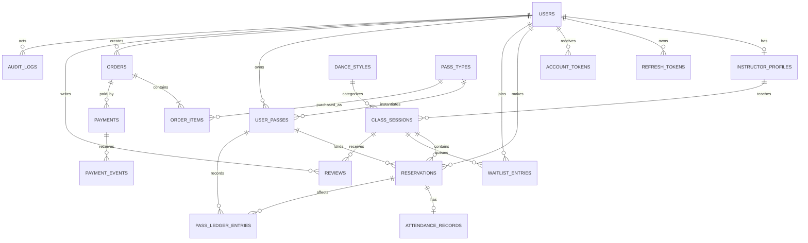

# DSMS: projekt bazy danych

## 1. Ustalenia ogólne

- Silnik bazy danych: MySQL 8, InnoDB, kodowanie `utf8mb4`.
- Klucze główne: `BIGINT UNSIGNED AUTO_INCREMENT`.
- Czas jest przechowywany w UTC w typie `DATETIME(6)`.
- Kwoty pieniężne: `DECIMAL(12,2)`.
- Waluta: trzyliterowy kod ISO 4217.
- Wszystkie zmiany schematu są wykonywane przez migracje Flyway.
- Dla modyfikowalnych encji używane są `created_at`, `updated_at` oraz
  optymistyczna wersja `version`, jeśli jest potrzebna.
- Usuwanie użytkowników, karnetów i danych finansowych jest logiczne.

## 2. Diagram ER

## 3. Tabele

### `users`

| Pole | Typ | Ograniczenia |
|---|---|---|
| `id` | BIGINT UNSIGNED | PK |
| `first_name` | VARCHAR(100) | NOT NULL |
| `last_name` | VARCHAR(100) | NOT NULL |
| `email` | VARCHAR(254) | NOT NULL, przechowywany małymi literami |
| `phone` | VARCHAR(32) | NULL |
| `password_hash` | VARCHAR(100) | NOT NULL |
| `role` | VARCHAR(20) | CLIENT, INSTRUCTOR, ADMIN |
| `status` | VARCHAR(20) | PENDING, ACTIVE, BLOCKED, DEACTIVATED |
| `avatar_object_key` | VARCHAR(500) | NULL |
| `email_verified_at` | DATETIME(6) | NULL |
| `failed_login_attempts` | SMALLINT UNSIGNED | NOT NULL DEFAULT 0 |
| `locked_until` | DATETIME(6) | NULL |
| `last_login_at` | DATETIME(6) | NULL |
| `created_at` | DATETIME(6) | NOT NULL |
| `updated_at` | DATETIME(6) | NOT NULL |
| `version` | BIGINT UNSIGNED | NOT NULL DEFAULT 0 |

Ograniczenia i indeksy:

- `UNIQUE(email)`;
- `INDEX(role, status)`;
- email jest normalizowany przez aplikację przed zapisem.

### `instructor_profiles`

| Pole | Typ | Ograniczenia |
|---|---|---|
| `id` | BIGINT UNSIGNED | PK |
| `user_id` | BIGINT UNSIGNED | NOT NULL, FK users, UNIQUE |
| `specialization` | VARCHAR(255) | NOT NULL |
| `description` | TEXT | NULL |
| `is_public` | BOOLEAN | NOT NULL DEFAULT TRUE |
| `created_at` | DATETIME(6) | NOT NULL |
| `updated_at` | DATETIME(6) | NOT NULL |

### `refresh_tokens`

| Pole | Typ | Ograniczenia |
|---|---|---|
| `id` | BIGINT UNSIGNED | PK |
| `user_id` | BIGINT UNSIGNED | NOT NULL, FK users |
| `token_hash` | CHAR(64) | NOT NULL, UNIQUE |
| `family_id` | CHAR(36) | NOT NULL |
| `expires_at` | DATETIME(6) | NOT NULL |
| `revoked_at` | DATETIME(6) | NULL |
| `replaced_by_hash` | CHAR(64) | NULL |
| `created_at` | DATETIME(6) | NOT NULL |
| `created_ip` | VARCHAR(45) | NULL |

Indeksy: `(user_id, expires_at)`, `(family_id)`.

### `account_tokens`

Jednorazowe tokeny do potwierdzenia emaila i resetu hasła.

| Pole | Typ | Ograniczenia |
|---|---|---|
| `id` | BIGINT UNSIGNED | PK |
| `user_id` | BIGINT UNSIGNED | NOT NULL, FK users |
| `type` | VARCHAR(30) | EMAIL_VERIFICATION, PASSWORD_RESET |
| `token_hash` | CHAR(64) | NOT NULL, UNIQUE |
| `expires_at` | DATETIME(6) | NOT NULL |
| `used_at` | DATETIME(6) | NULL |
| `created_at` | DATETIME(6) | NOT NULL |

### `dance_styles`

| Pole | Typ | Ograniczenia |
|---|---|---|
| `id` | BIGINT UNSIGNED | PK |
| `name` | VARCHAR(100) | NOT NULL, UNIQUE |
| `description` | TEXT | NULL |
| `active` | BOOLEAN | NOT NULL DEFAULT TRUE |
| `created_at` | DATETIME(6) | NOT NULL |
| `updated_at` | DATETIME(6) | NOT NULL |

### `class_sessions`

| Pole | Typ | Ograniczenia |
|---|---|---|
| `id` | BIGINT UNSIGNED | PK |
| `title` | VARCHAR(150) | NOT NULL |
| `description` | TEXT | NULL |
| `dance_style_id` | BIGINT UNSIGNED | NOT NULL, FK dance_styles |
| `level` | VARCHAR(20) | BEGINNER, INTERMEDIATE, ADVANCED, ALL |
| `instructor_id` | BIGINT UNSIGNED | NOT NULL, FK instructor_profiles |
| `capacity` | SMALLINT UNSIGNED | NOT NULL, > 0 |
| `start_at` | DATETIME(6) | NOT NULL |
| `duration_minutes` | SMALLINT UNSIGNED | NOT NULL, > 0 |
| `status` | VARCHAR(20) | DRAFT, PUBLISHED, CANCELLED, COMPLETED |
| `cancellation_reason` | VARCHAR(500) | NULL |
| `created_by` | BIGINT UNSIGNED | NOT NULL, FK users |
| `created_at` | DATETIME(6) | NOT NULL |
| `updated_at` | DATETIME(6) | NOT NULL |
| `version` | BIGINT UNSIGNED | NOT NULL DEFAULT 0 |

Indeksy:

- `(status, start_at)`;
- `(instructor_id, start_at)`;
- `(dance_style_id, level, start_at)`.

### `reservations`

| Pole | Typ | Ograniczenia |
|---|---|---|
| `id` | BIGINT UNSIGNED | PK |
| `user_id` | BIGINT UNSIGNED | NOT NULL, FK users |
| `class_session_id` | BIGINT UNSIGNED | NOT NULL, FK class_sessions |
| `user_pass_id` | BIGINT UNSIGNED | NOT NULL, FK user_passes |
| `status` | VARCHAR(30) | CONFIRMED, CANCELLED, LATE_CANCELLED, NO_SHOW, ATTENDED |
| `source` | VARCHAR(20) | CLIENT, WAITLIST, ADMIN |
| `cancelled_at` | DATETIME(6) | NULL |
| `cancellation_reason` | VARCHAR(500) | NULL |
| `created_at` | DATETIME(6) | NOT NULL |
| `updated_at` | DATETIME(6) | NOT NULL |

Ograniczenia i indeksy:

- `UNIQUE(user_id, class_session_id)` zachowuje jedną historię rezerwacji na zajęcia;
- `(class_session_id, status)`;
- `(user_id, status, created_at)`.

Ponowny zapis po anulowaniu aktualizuje istniejący wiersz w ramach dozwolonych
zasad, zamiast tworzyć duplikat.

### `waitlist_entries`

| Pole | Typ | Ograniczenia |
|---|---|---|
| `id` | BIGINT UNSIGNED | PK |
| `user_id` | BIGINT UNSIGNED | NOT NULL, FK users |
| `class_session_id` | BIGINT UNSIGNED | NOT NULL, FK class_sessions |
| `position` | INT UNSIGNED | NOT NULL |
| `status` | VARCHAR(20) | WAITING, PROMOTED, CANCELLED, EXPIRED |
| `created_at` | DATETIME(6) | NOT NULL |
| `updated_at` | DATETIME(6) | NOT NULL |

Ograniczenia i indeksy:

- `UNIQUE(user_id, class_session_id)`;
- `UNIQUE(class_session_id, position)`;
- `(class_session_id, status, position)`.

### `pass_types`

| Pole | Typ | Ograniczenia |
|---|---|---|
| `id` | BIGINT UNSIGNED | PK |
| `name` | VARCHAR(100) | NOT NULL |
| `description` | TEXT | NULL |
| `type` | VARCHAR(20) | LIMITED, UNLIMITED |
| `visit_count` | SMALLINT UNSIGNED | NULL dla UNLIMITED |
| `validity_days` | SMALLINT UNSIGNED | NOT NULL, > 0 |
| `price` | DECIMAL(12,2) | NOT NULL, >= 0 |
| `currency` | CHAR(3) | NOT NULL DEFAULT PLN |
| `active` | BOOLEAN | NOT NULL DEFAULT TRUE |
| `created_at` | DATETIME(6) | NOT NULL |
| `updated_at` | DATETIME(6) | NOT NULL |
| `version` | BIGINT UNSIGNED | NOT NULL DEFAULT 0 |

Walidacja aplikacyjna:

- LIMITED wymaga dodatniego `visit_count`;
- UNLIMITED wymaga `visit_count = NULL`.

### `user_passes`

| Pole | Typ | Ograniczenia |
|---|---|---|
| `id` | BIGINT UNSIGNED | PK |
| `user_id` | BIGINT UNSIGNED | NOT NULL, FK users |
| `pass_type_id` | BIGINT UNSIGNED | NOT NULL, FK pass_types |
| `order_item_id` | BIGINT UNSIGNED | NULL, FK order_items, UNIQUE |
| `status` | VARCHAR(20) | ACTIVE, EXPIRED, EXHAUSTED, CANCELLED |
| `remaining_visits` | SMALLINT UNSIGNED | NULL dla UNLIMITED |
| `valid_from` | DATETIME(6) | NOT NULL |
| `valid_until` | DATETIME(6) | NOT NULL |
| `created_at` | DATETIME(6) | NOT NULL |
| `updated_at` | DATETIME(6) | NOT NULL |
| `version` | BIGINT UNSIGNED | NOT NULL DEFAULT 0 |

Indeksy: `(user_id, status, valid_until)`.

### `pass_ledger_entries`

Niezmienialny rejestr operacji na wejściach.

| Pole | Typ | Ograniczenia |
|---|---|---|
| `id` | BIGINT UNSIGNED | PK |
| `user_pass_id` | BIGINT UNSIGNED | NOT NULL, FK user_passes |
| `reservation_id` | BIGINT UNSIGNED | NULL, FK reservations |
| `type` | VARCHAR(30) | RESERVE, RELEASE, CONSUME, ADJUST |
| `visit_delta` | SMALLINT | NOT NULL |
| `balance_after` | SMALLINT UNSIGNED | NULL dla UNLIMITED |
| `reason` | VARCHAR(500) | NULL |
| `performed_by` | BIGINT UNSIGNED | NULL, FK users |
| `created_at` | DATETIME(6) | NOT NULL |

Indeksy: `(user_pass_id, created_at)`, `(reservation_id)`.

### `attendance_records`

| Pole | Typ | Ograniczenia |
|---|---|---|
| `id` | BIGINT UNSIGNED | PK |
| `reservation_id` | BIGINT UNSIGNED | NOT NULL, FK reservations, UNIQUE |
| `status` | VARCHAR(20) | PRESENT, ABSENT |
| `marked_by` | BIGINT UNSIGNED | NOT NULL, FK users |
| `marked_at` | DATETIME(6) | NOT NULL |
| `updated_at` | DATETIME(6) | NOT NULL |

### `orders`

| Pole | Typ | Ograniczenia |
|---|---|---|
| `id` | BIGINT UNSIGNED | PK |
| `public_id` | CHAR(36) | NOT NULL, UNIQUE |
| `user_id` | BIGINT UNSIGNED | NOT NULL, FK users |
| `status` | VARCHAR(20) | NEW, PENDING, PAID, CANCELLED, EXPIRED, FAILED |
| `total_amount` | DECIMAL(12,2) | NOT NULL |
| `currency` | CHAR(3) | NOT NULL |
| `expires_at` | DATETIME(6) | NOT NULL |
| `paid_at` | DATETIME(6) | NULL |
| `created_at` | DATETIME(6) | NOT NULL |
| `updated_at` | DATETIME(6) | NOT NULL |
| `version` | BIGINT UNSIGNED | NOT NULL DEFAULT 0 |

Indeksy: `(user_id, created_at)`, `(status, expires_at)`.

### `order_items`

Cena i nazwa są kopiowane do zamówienia, aby zmiany w katalogu nie modyfikowały
historii zakupu.

| Pole | Typ | Ograniczenia |
|---|---|---|
| `id` | BIGINT UNSIGNED | PK |
| `order_id` | BIGINT UNSIGNED | NOT NULL, FK orders |
| `pass_type_id` | BIGINT UNSIGNED | NOT NULL, FK pass_types |
| `item_name` | VARCHAR(100) | NOT NULL |
| `quantity` | SMALLINT UNSIGNED | NOT NULL DEFAULT 1 |
| `unit_price` | DECIMAL(12,2) | NOT NULL |
| `total_price` | DECIMAL(12,2) | NOT NULL |
| `created_at` | DATETIME(6) | NOT NULL |

### `payments`

| Pole | Typ | Ograniczenia |
|---|---|---|
| `id` | BIGINT UNSIGNED | PK |
| `order_id` | BIGINT UNSIGNED | NOT NULL, FK orders |
| `provider` | VARCHAR(20) | PAYU |
| `provider_order_id` | VARCHAR(100) | NULL, UNIQUE |
| `payment_method` | VARCHAR(30) | BLIK, CARD, BANK_TRANSFER, OTHER |
| `status` | VARCHAR(20) | NEW, PENDING, PAID, CANCELLED, ERROR |
| `amount` | DECIMAL(12,2) | NOT NULL |
| `currency` | CHAR(3) | NOT NULL |
| `redirect_url` | VARCHAR(1000) | NULL |
| `failure_code` | VARCHAR(100) | NULL |
| `created_at` | DATETIME(6) | NOT NULL |
| `updated_at` | DATETIME(6) | NOT NULL |

Indeksy: `(order_id, created_at)`, `(status, created_at)`.

### `payment_events`

| Pole | Typ | Ograniczenia |
|---|---|---|
| `id` | BIGINT UNSIGNED | PK |
| `payment_id` | BIGINT UNSIGNED | NULL, FK payments |
| `provider_event_id` | VARCHAR(150) | NOT NULL, UNIQUE |
| `event_type` | VARCHAR(100) | NOT NULL |
| `signature_valid` | BOOLEAN | NOT NULL |
| `payload` | JSON | NOT NULL |
| `processed_at` | DATETIME(6) | NULL |
| `processing_error` | VARCHAR(1000) | NULL |
| `created_at` | DATETIME(6) | NOT NULL |

### `reviews`

| Pole | Typ | Ograniczenia |
|---|---|---|
| `id` | BIGINT UNSIGNED | PK |
| `user_id` | BIGINT UNSIGNED | NOT NULL, FK users |
| `class_session_id` | BIGINT UNSIGNED | NOT NULL, FK class_sessions |
| `rating` | TINYINT UNSIGNED | NOT NULL, 1..5 |
| `comment` | VARCHAR(2000) | NULL |
| `visible` | BOOLEAN | NOT NULL DEFAULT TRUE |
| `hidden_by` | BIGINT UNSIGNED | NULL, FK users |
| `hidden_at` | DATETIME(6) | NULL |
| `created_at` | DATETIME(6) | NOT NULL |
| `updated_at` | DATETIME(6) | NOT NULL |

Ograniczenie: `UNIQUE(user_id, class_session_id)`.

### `events`

Model wydarzeń pozostaje oddzielony od zwykłych zajęć.

| Pole | Typ | Ograniczenia |
|---|---|---|
| `id` | BIGINT UNSIGNED | PK |
| `title` | VARCHAR(150) | NOT NULL |
| `description` | TEXT | NULL |
| `start_at` | DATETIME(6) | NOT NULL |
| `duration_minutes` | SMALLINT UNSIGNED | NOT NULL |
| `capacity` | SMALLINT UNSIGNED | NOT NULL |
| `price` | DECIMAL(12,2) | NOT NULL |
| `currency` | CHAR(3) | NOT NULL |
| `status` | VARCHAR(20) | DRAFT, PUBLISHED, CANCELLED, COMPLETED |
| `created_by` | BIGINT UNSIGNED | NOT NULL, FK users |
| `created_at` | DATETIME(6) | NOT NULL |
| `updated_at` | DATETIME(6) | NOT NULL |

Sprzedaż biletów na wydarzenia wymaga osobnego doprecyzowania i nie wchodzi do
pierwszej migracji, dopóki scenariusz D-10 nie zostanie potwierdzony.

### `notification_outbox`

| Pole | Typ | Ograniczenia |
|---|---|---|
| `id` | BIGINT UNSIGNED | PK |
| `event_type` | VARCHAR(100) | NOT NULL |
| `aggregate_type` | VARCHAR(100) | NOT NULL |
| `aggregate_id` | VARCHAR(100) | NOT NULL |
| `recipient` | VARCHAR(254) | NOT NULL |
| `template_key` | VARCHAR(100) | NOT NULL |
| `payload` | JSON | NOT NULL |
| `status` | VARCHAR(20) | PENDING, PROCESSING, SENT, FAILED |
| `attempt_count` | SMALLINT UNSIGNED | NOT NULL DEFAULT 0 |
| `available_at` | DATETIME(6) | NOT NULL |
| `sent_at` | DATETIME(6) | NULL |
| `last_error` | VARCHAR(1000) | NULL |
| `created_at` | DATETIME(6) | NOT NULL |

Indeks: `(status, available_at)`.

### `audit_logs`

| Pole | Typ | Ograniczenia |
|---|---|---|
| `id` | BIGINT UNSIGNED | PK |
| `actor_user_id` | BIGINT UNSIGNED | NULL, FK users |
| `action` | VARCHAR(100) | NOT NULL |
| `entity_type` | VARCHAR(100) | NOT NULL |
| `entity_id` | VARCHAR(100) | NULL |
| `details` | JSON | NULL |
| `ip_address` | VARCHAR(45) | NULL |
| `created_at` | DATETIME(6) | NOT NULL |

Indeksy: `(actor_user_id, created_at)`, `(entity_type, entity_id)`.

## 4. Integralność danych

Część zasad jest zapewniana przez bazę danych:

- unikalność emaili, tokenów i zewnętrznych identyfikatorów płatności;
- unikalność rezerwacji i opinii klienta dla danych zajęć;
- klucze obce między agregatami;
- unikalna pozycja w kolejce;
- niezmienialna historia finansowa.

Zasady wymagające transakcyjnej weryfikacji po stronie aplikacji:

- pojemność zajęć;
- brak możliwości jednoczesnego bycia w rezerwacji i kolejce;
- ważność karnetu w dniu zajęć;
- poprawne przejścia statusów;
- prawo instruktora do zmiany obecności tylko na własnych zajęciach;
- tworzenie opinii wyłącznie przy `PRESENT`;
- zgodność kwoty callbacku z zamówieniem.

## 5. Usuwanie i przechowywanie

- Rekordy finansowe, ledger i audit nie są fizycznie usuwane.
- Użytkownik jest dezaktywowany, a dane osobowe mogą zostać zanonimizowane
  zgodnie z zatwierdzoną polityką.
- Zajęcia z rezerwacjami są anulowane, ale nie usuwane.
- Typ karnetu ze sprzedażą jest dezaktywowany.
- Terminy przechowywania payloadów płatności i logów są ustalane przed production.
